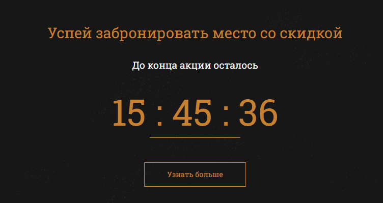

# Timer! #

The module is implemented using html, css, js. 

+ For the timer to function, it is necessary to set the deadline. In the code, this is a variable: deadline

+ The function setClock(id, endtime) accepts the following arguments: 
   * timer class id
   * deadline

+ If there is a need to expand the timer functionality (add days), then it is possible to do this by adding the following code to the function "getTimeRemaining":

      hours = Math.floor((t/1000/60/60) % 24);
      days = Math.floor (t/(1000*60*60*24));
    
+ The "adiZero" function is designed to display the timer in the format: 00:00:00
